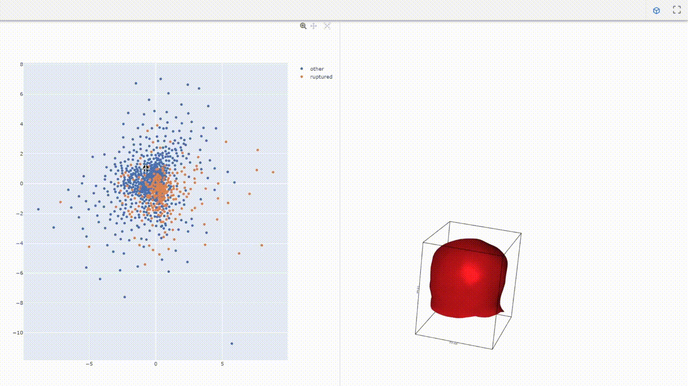

# Aneurysm Latent Space

## Files

### 01_preprocessing

- `remesh_aneurysms.py` Register, resample, and remesh aneurysm sacs with consistent vertex ordering.
- `measure_aneurysms.py` Compute size and shape measures for aneurysm geometries.

### 02_experiments

- `train_ae.py`Autoencoder training script; unsupervised.
- `train_vae.py` Variational autoencoder training script; unsupervised.
- `train_vae_classifier.py` Variational autoencoder with MLP head training script (for classification only); semi-supervised.

### data

Contains pre-build face matrices for visualizer. Can be used for other data (meshes, labels) as well.

### src

- `dataset.py` Aneurysm mesh dataset loader for Pytorch.
- `pointnet_ae.py` PointNet autoencoder.
- `pointnet_vae.py` PointNet variational autoencoder with KLD.
- `utils.py` Additional loading utilities.

### weights

Pre-trained AE/VAE encoder and decoder weights for different mesh resolutions.

### Visualizer

`LatentSpaceVisualizer.py` Small application to interactively explore the created latent spaces.

<p align="center">
  
</p>

## Dependencies

Setup with conda:

```bash
> conda create -n ls_env -c conda-forge python=3.11 trame trame-vuetify trame-vtk trame-components trame-plotly plotly pyvista numpy pandas
> conda activate ls_env
> pip install libigl
```

If CUDA-enabled use:

```bash
> conda install pytorch torchvision pytorch-cuda=12.1 -c pytorch -c nvidia
```

If not CUDA-enabled use:

```bash
> conda install pytorch torchvision cpuonly -c pytorch
```
